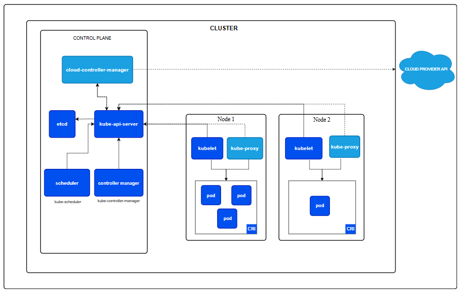

# kube-apiserver in Kubernetes
- The API server acts as the front-end for kubernetes. The users, management devices, Command line interfaces all talk to the API server to interact with the kubernetes cluster.
- Kube API Server acts as the central management component in a Kubernetes cluster by handling requests from kubectl, validating and authenticating them, interfacing with the etcd datastore, and coordinating with other system components.
* The **kube-apiserver** is the **central management component** of the Kubernetes control plane. It acts as the **front-end (entry point)** for all communication with the Kubernetes cluster.
    - Every operation — whether you use `kubectl`, another control plane component, or a Kubernetes Dashboard — **passes through the API server**.

* It is responsible for **exposing the Kubernetes API** — the interface that both **internal components** (`kube-scheduler`, `kube-controller-manager`, and `kubelet`) and **external clients** (like `kubectl`, Helm, or REST API calls) use to communicate.

* The **API Server** validates and processes **RESTful API requests** (create, read, update, delete – CRUD operations) sent by users or cluster components.

* It’s responsible for:
    1. Authenticating & Authorizing users.
    2. Validating API requests.
    3. Storing data in etcd.
    4. Serving responses to clients.

* It is the **only component** that communicates **directly with etcd**, the key-value store.
  All cluster state data is stored in etcd, but **only through the API Server**.

* Every command you execute with `kubectl` (for example, `kubectl get pods`) first goes to the **kube-apiserver**, which then fetches the requested data from **etcd** and returns it as a response.

* Similarly, when you create a new resource (like `kubectl apply -f deployment.yaml`), the **API Server**:

  1. Authenticates and authorizes the user.
  2. Validating API requests, Validates the YAML manifest.
  3. Stores the object definition in etcd.
  4. Notifies other components (like Controller Manager and Scheduler) about the change.

* The kube-apiserver ensures **communication security** via **TLS encryption** and **authentication mechanisms** such as:

  * Client certificates
  * Bearer tokens
  * Service accounts
  * OpenID Connect (OIDC)

* It also performs **authorization checks** using policies like:

  * RBAC (Role-Based Access Control)
  * ABAC (Attribute-Based Access Control)
  * Node authorization

* kube-apiserver handles **admission control**, where incoming requests pass through a series of **Admission Controllers** that can **modify, validate, or reject** requests based on cluster rules or policies.

* It supports **horizontal scaling** and it is **Stateless** — meaning you can run **multiple kube-apiserver instances** behind a load balancer to improve availability and distribute load.

* The API Server runs as a **pod on the control plane node** (usually under the `kube-system` namespace when deployed via kubeadm).

* The default listening port for the **secure API endpoint** is **`6443`**.
  You interact with it through `https://<control-plane-IP>:6443`.

* kube-apiserver continuously maintains **cluster consistency** by watching etcd for changes and notifying other components accordingly.

* In High Availability (HA) setups, multiple **kube-apiserver** instances are deployed behind a **load balancer**, all pointing to the same **etcd cluster**.

---


## API Server Request Lifecycle (Deep Dive)

Let’s go step by step through what happens when you run a command like:

```bash
kubectl get nodes
```

### Step 1: Request Initiation

* The `kubectl` client sends a **REST API call** to the API Server endpoint (e.g., `https://<control-plane-IP>:6443/api/v1/nodes`).
* The request includes:

  * Method: `GET`
  * Headers: authentication token or certificate
  * URL: identifying the resource (`/api/v1/nodes`)

### Step 2: Authentication

* The API Server verifies **who** is making the request.
  Supported mechanisms:

  * **Client Certificates:** Used by system components (`kubelet`, controllers).
  * **Bearer Tokens / Service Accounts:** Used by applications or dashboards.
  * **OpenID Connect (OIDC):** Used for integration with identity providers (like Google, Azure AD).
> If credentials are invalid or missing → request is rejected with 401 Unauthorized.  

### Step 3: Authorization

* Once authenticated, it checks **what the user is allowed to do.**
  Supported authorization modes:

  * **RBAC (Role-Based Access Control):** Most common; permissions based on roles & bindings.
  * **Node Authorization:** For kubelet requests.
  * **ABAC:** Based on user attributes (older method).
* Example:
  A user with only “view” permissions cannot create or delete pods.  
> If user lacks permission → 403 Forbidden.  

### Step 4: Admission Control

- After authorization, the request goes through Admission Controllers, which can:
    - **Mutate** the request (e.g., add default values).
    - **Validate** policy compliance (e.g., disallow privileged pods).
    - **Deny** if it violates constraints (like exceeding resource quotas).

* Examples
    * **NamespaceLifecycle** controller blocks creation in non-existent namespaces.  
    * **ResourceQuota** controller ensures users don’t exceed resource limits.   
    * **LimitRanger** → applies default limits.  

* Admission controllers act as **guardians** for the cluster.

### Step 5: Validation & Schema Check

* kube-apiserver validates that the incoming object conforms to Kubernetes’ **OpenAPI schema**.

  * Example: A pod must have `spec.containers` defined — otherwise, it’s rejected.
> Invalid schema → request rejected with 422 Unprocessable Entity.  

### Step 6: Data Storage & Update

* Once validated, the API Server **stores the object definition** in **etcd**.

  * Example: When you run `kubectl apply -f pod.yaml`, the pod spec gets stored in `/registry/pods/<namespace>/<podname>` in etcd.
* `etcd` then becomes the source of truth for that object.

### Step 7: Notifies other components
* Once etcd is updated, API Server notifies relevant controllers and schedulers via the watch mechanism.

* Example: 
    * **Scheduler** gets notified when a new Pod object is created.
    * **Controller Manager** gets notified when ReplicaSet count changes.

### Step 8: Response to Client

* The API Server sends a structured JSON response back to the client.

  * For `kubectl get nodes`, the response might look like:

    ```
    NAME      STATUS   ROLES    AGE   VERSION
    master    Ready    master   20m   v1.29.0
    node01    Ready    <none>   20m   v1.29.0
    ```

---

## Mnemonic Tip: 

1. Request Initiation
2. Checks **who** (Authenticate)
3. Confirms **permissions** (Authorize)
4. Applies **rules** (Admit)
5. Ensures **data correctness** (Validate)
6. **Stores** data in etcd (Store)
7. **Notifies** other cluster components (Notify)
8. **Serves** the response (Response back)

---

## Example — Creating a Pod via API

When a **direct POST API request** is made to create a pod, the internal flow looks like this:

```bash
curl -k -X POST \
  https://<control-plane-IP>:6443/api/v1/namespaces/default/pods \
  -H "Authorization: Bearer <token>" \
  -H "Content-Type: application/json" \
  -d '{
        "apiVersion": "v1",
        "kind": "Pod",
        "metadata": { "name": "my-pod" },
        "spec": { "containers": [{ "name": "nginx", "image": "nginx" }] }
      }'
```

**Internally:**

1. kube-apiserver **authenticates** and **authorizes** the request.
2. It **validates** the JSON structure.
3. It **creates a new Pod object** (without a node assignment) and **stores it in etcd**.
4. It **returns** an HTTP 201 Created response:

   ```json
   {"kind":"Pod","metadata":{"name":"my-pod"},"status":"Created"}
   ```
5. Later, the **kube-scheduler** notices this new unscheduled Pod (via API watch) and assigns it to a node.

> Hence, **`kube-apiserver`** acts as the **gatekeeper + database writer + informer** for all cluster activity.

---

### Communication Flow Between Components

| Component                                    | Communicates Through | Purpose                           |
| -------------------------------------------- | -------------------- | --------------------------------- |
| **kubectl → kube-apiserver**                 | HTTPS (port 6443)    | User commands                     |
| **kube-scheduler → kube-apiserver**          | REST API             | Reads unscheduled pods            |
| **kube-controller-manager → kube-apiserver** | REST API             | Watches for object changes        |
| **kubelet → kube-apiserver**                 | HTTPS                | Registers node & updates status   |
| **etcd ↔ kube-apiserver**                    | gRPC/TLS             | Stores and retrieves cluster data |

> *Every single action in the cluster flows through kube-apiserver.*

---

## Key Features & Functions

* **Centralized API endpoint** for the entire cluster.
* **Authentication & Authorization** enforcement point.
* **Admission control** for request governance.
* **Validation & Conversion** of API objects.
* **Storage abstraction** (etcd behind the scenes).
* **Watch & Notify** mechanism — keeps other components updated in real time.
* **Stateless design** — enables horizontal scaling and HA setups.

---

## Health and Troubleshooting

* Check API server status:

  ```bash
  kubectl get componentstatus
  ```
* View logs:

  ```bash
  journalctl -u kube-apiserver -f
  ```
* Check health endpoints:

  ```bash
  curl -k https://localhost:6443/healthz
  curl -k https://localhost:6443/version
  ```

---

## Summary Table

| Property           | Detail                                       |
| ------------------ | -------------------------------------------- |
| **Component Type** | Control Plane                                |
| **Runs On**        | Master/Control Plane Node                    |
| **Default Port**   | 6443                                         |
| **Data Source**    | etcd                                         |
| **Stateless**      | Yes                                          |
| **Protocol**       | HTTPS (REST)                                 |
| **Authentication** | Certificates, Tokens, OIDC                   |
| **Authorization**  | RBAC, ABAC, Node                             |
| **Major Role**     | Entry point for all Kubernetes communication |

---

